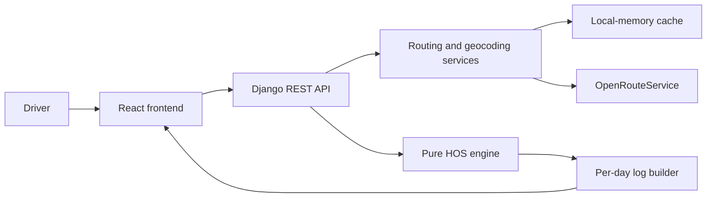

# ELD Trip Planner

A trip-planning assessment for property-carrying drivers: route a trip, schedule
duty changes, and generate a Driver's Daily Log for each calendar day.

**Current stage: Phase 1 — pure HOS engine and tests.** Repository tooling and
the duty scheduler are implemented. The routing API, frontend, and daily log
builder follow in subsequent phases.

## Planned stack and architecture

- Backend: Python 3.12, Django 5, Django REST Framework, and pytest.
- Frontend: React 18, Vite, TypeScript, Tailwind CSS, and Leaflet.
- Routing: server-side OpenRouteService, with provider caching and documented
  fallback behavior.
- Deployment: frontend on Vercel; backend on Render or Railway.



The frontend must never receive the routing API key. The HOS engine will have no
network, framework, or database dependencies.

## Repository layout

```text
backend/
  trips/services/       Pure HOS scheduling and immutable event/state models
  trips/tests/          Boundary cases and generated-trip invariant checks
  requirements-dev.txt  Pinned pytest and Hypothesis test dependencies
frontend/               Frontend environment template; application follows in Phase 4
.github/workflows/      CI for file hygiene and application quality
.pre-commit-config.yaml Staged secret scanning, linters, and format checks
requirements-dev.txt    Pinned Python repository tools
package.json            Pinned Node repository tools
```

## Repository tooling setup

Install Python 3.12 and Node.js 22 LTS or newer. Run these commands from the
repository root.

### Windows PowerShell

```powershell
# Create a local virtual environment if one does not already exist.
py -3.12 -m venv .venv

# Install the Python tools without changing global Python packages.
.\.venv\Scripts\python.exe -m pip install -r requirements-dev.txt

# Install the locked Node tools.
npm.cmd ci

# Install the commit hook; this changes .git and is run by the repository owner.
.\.venv\Scripts\python.exe -m pre_commit install
```

If `py` is unavailable, use the full path to your Python 3.12 executable for the
first command. An existing `.venv` does not need to be recreated.

### Bash / zsh on macOS or Linux

```bash
# Create the Python environment.
python3.12 -m venv .venv

# Install the Python tools.
.venv/bin/python -m pip install -r requirements-dev.txt

# Install the Node tools.
npm ci

# Install the commit hook; the repository owner runs this command.
.venv/bin/python -m pre_commit install
```

### Checks

```powershell
# Check supported text files with Prettier.
npm.cmd run format:check

# Validate the hook configuration without running Git.
.\.venv\Scripts\python.exe -m pre_commit validate-config

# After files are staged, run every commit hook, including staged secret scanning.
.\.venv\Scripts\python.exe -m pre_commit run --all-files
```

On macOS/Linux, replace `npm.cmd` with `npm` and
`.\.venv\Scripts\python.exe` with `.venv/bin/python`.

The GitHub workflow runs on every push and pull request. Repository hygiene runs
immediately. Backend lint, formatting, and tests activate when
`backend/requirements-dev.txt` is introduced. Frontend lint, typecheck, Vitest,
and build activate when `frontend/package.json` is introduced. Python and
frontend source hooks skip when there are no matching source files in Phase 0.
CI scans repository history for secrets; the commit hook scans staged changes.
The backend job is active from Phase 1. Frontend checks remain inactive until the
frontend is introduced.

## HOS engine setup and verification

From the repository root in Windows PowerShell:

```powershell
# Install the backend's pinned test tools.
./.venv/Scripts/python.exe -m pip install -r backend/requirements-dev.txt

# Run boundary examples and independent replay of generated schedules.
./.venv/Scripts/python.exe -m pytest -q

# Check Python lint and formatting.
./.venv/Scripts/python.exe -m ruff check backend
./.venv/Scripts/python.exe -m black --check backend
```

On macOS/Linux, replace `./.venv/Scripts/python.exe` with
`.venv/bin/python`. Pytest also works from `backend/`, matching CI.

`backend/trips/services/hos_engine.py` exports:

- `schedule_trip(legs, cycle_used_hours, config=...)`: deterministic scheduling
  of exactly two connected legs, with one pickup and one delivery.
- `advance_clock(state, status, duration_min)`: a pure duty-clock transition
  that rejects an illegal driving interval and returns a new immutable state.
- `available_driving_minutes(state)`: the tightest remaining HOS allowance.

Domain events carry integer minutes since departure, exact fractional mileage,
duty status, event type, stable IDs, and cycle usage before/after the interval.
The mile marker and place refer to the interval's start/status-change position;
driving intervals also expose both mileage endpoints.
The API service will later add timestamps, coordinates, and reverse-geocoded
remarks; the engine makes no I/O calls.

The tests cover short and multi-day trips, the 8/11/14-hour boundaries, 30-minute
breaks, 10-hour rests, 34-hour restarts, 1,000-mile fuel frontiers, zero-mile legs,
cycle overflow during work, simultaneous constraints, and fractional inputs.
Two Hypothesis tests generate 450 schedules per run, plus explicit regression
examples. A separate event replayer checks every driving interval against the
clocks without using the engine's transition functions.

## Environment and secrets

- Backend configuration belongs in `backend/.env`, copied from
  `backend/.env.example`. All example values are empty.
- `ORS_API_KEY` belongs only in the backend environment or the backend host's
  secret settings. Never put it in frontend configuration or Git commands.
- Frontend configuration belongs in `frontend/.env`, copied from
  `frontend/.env.example`. `VITE_API_BASE_URL` is public configuration.
- `.gitignore` excludes real environment files, virtual environments,
  dependencies, caches, logs, and build output.
- Before the first commit, the repository owner verifies
  `git check-ignore -v backend/.env` and reviews the staged paths.
- If a secret is committed, rotate it; deleting it from the current files does
  not remove exposure from history.

## Assumptions and HOS rules

The implementation follows the property-carrying rules in the
[FMCSA HOS summary](https://www.fmcsa.dot.gov/regulations/hours-service/summary-hours-service-regulations).

| Constraint                | Implementation                                                                                                                       |
| ------------------------- | ------------------------------------------------------------------------------------------------------------------------------------ |
| 11-hour driving allowance | At most 660 driving minutes between qualifying daily rests                                                                           |
| 14-hour duty window       | Driving ends by 840 elapsed minutes after the first on-duty activity; short off-duty pauses do not extend it                         |
| Driving break             | Before exceeding 480 accumulated driving minutes, require 30 consecutive non-driving minutes; mixed non-driving statuses can qualify |
| 70-hour cycle             | Driving and on-duty work consume cycle hours; prohibit further driving at 4,200 minutes                                              |
| Daily rest                | 600 continuous minutes in OFF/SLEEPER restore daily driving and window allowances                                                    |
| Restart                   | 2,040 continuous minutes in OFF/SLEEPER restore cycle and daily allowances                                                           |
| Fuel                      | A 30-minute ON_DUTY stop before driving beyond a 1,000-mile gap                                                                      |

Additional assessment assumptions:

- A property-carrying solo driver using the 70-hour / 8-day cycle.
- No cycle hours drop off during the trip because the input does not include
  the driver's historical daily hours.
- A fresh daily driving allowance and duty window at trip start; the supplied
  cycle usage is the only prior-duty input.
- Driving is on-duty activity and starts the duty window if it is the first
  activity. Midnight by itself resets no HOS clock.
- Provider distance determines mileage; driving time uses a configurable
  planning speed of 55 mph.
- Pickup and dropoff each take one hour on duty; fueling takes 30 minutes on
  duty at intervals of no more than 1,000 miles.
- Use a consistent start-time offset for log-day boundaries.

### Boundary and rounding decisions

- Arrival work happens before a pause needed for the next drive. Pickup,
  delivery, and fueling can finish even when non-driving work takes cycle usage
  above 70 hours. No driving follows until the cycle is reset. Available cycle
  hours are clamped at zero while exhausted.
- At exactly eight driving hours, a one-hour pickup satisfies the break.
  A final arrival does not add a gratuitous break, rest, restart, or fuel stop.
  A fuel gap of exactly 1,000 miles is allowed at the final destination; fuel is
  inserted at that mile marker before any additional driving.
- If limits coincide, resolve cycle restart, daily rest, fuel, then driving
  break. A fuel stop satisfies the driving break. Fuel and a sleeper rest retain
  their distinct duty statuses at the same route position.
- All clocks use integer minutes. Initial cycle usage is rounded up to the next
  minute. Distances use exact rational arithmetic derived from the supplied
  decimal mileage; fuel frontiers remain exactly 1,000 miles.
- Driving duration uses `miles / average_mph * 60`, rounded up at each fuel
  frontier or leg end. This can add less than one minute at each such frontier
  while preserving provider mileage and never understating driving time.
- The public API will keep pickup and delivery at 60 minutes. Domain-level
  fixtures use longer pickup durations to exercise the 14-hour limit directly.
- The pure engine accepts an already exhausted cycle, including values above
  70, and restarts first. The future API will enforce its specified 0–70 input
  range.

Split-sleeper pairing, adverse-driving extensions, short-haul exceptions, and
team drivers are outside the assessment scope. Daily-log 24-hour invariants and
recap treatment are part of Phase 3.

## Delivery phases

| Phase | Work                                            |
| ----- | ----------------------------------------------- |
| 0     | Repository foundation, hooks, and CI            |
| 1     | Pure HOS engine and boundary/invariant tests    |
| 2     | Routing, geocoding, and stateless REST API      |
| 3     | Calendar-day log builder and 24-hour invariants |
| 4     | Frontend shell, form, autocomplete, and map     |
| 5     | Itinerary and trip summary                      |
| 6     | Daily Log SVG rendering and PNG/PDF exports     |
| 7     | Accessibility, responsive layout, and polish    |
| 8     | Deployment configuration and final verification |

The repository owner executes all Git commands. Every phase starts after a
verified before-checkpoint and ends with reviewed paths, passing checks,
Conventional Commits, and a verified push. After the initial setup commit,
changes use short-lived phase branches and pull requests into `main`.

## Submission documentation to complete

- Application setup and sample-trip walkthrough.
- API contract and provider failure behavior.
- Screenshots: desktop planner, mobile planner, and daily log.
- Vercel and Render/Railway deployment steps and free-tier wake-up behavior.
- A 3–5 minute Loom talk track: sample trip, HOS engine, log rendering, code
  structure, Git workflow, and trade-offs.

## Tooling references

- [pre-commit setup and hook configuration](https://pre-commit.com/)
- [File hygiene hooks](https://github.com/pre-commit/pre-commit-hooks)
- [Gitleaks staged secret scanning](https://github.com/gitleaks/gitleaks/tree/v8.24.2)

## License

[MIT](LICENSE).
