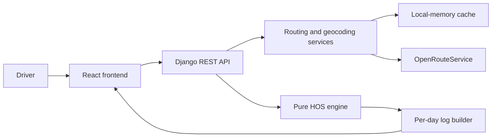

# ELD Trip Planner

A trip-planning assessment for property-carrying drivers: route a trip, schedule
duty changes, and generate a Driver's Daily Log for each calendar day.

**Current stage: Phase 0 — repository foundation.** The applications, HOS engine,
and log exports are not implemented yet. No application test or deployment claims
are made at this stage.

## Planned stack and architecture

- Backend: Python 3.12, Django 5, Django REST Framework, and pytest.
- Frontend: React 18, Vite, TypeScript, Tailwind CSS, and Leaflet.
- Routing: server-side OpenRouteService, with provider caching and documented
  fallback behavior.
- Deployment: frontend on Vercel; backend on Render or Railway.



The frontend must never receive the routing API key. The HOS engine will have no
network, framework, or database dependencies.

## Repository layout

```text
backend/                Backend environment template; application follows in Phase 1
frontend/               Frontend environment template; application follows in Phase 4
.github/workflows/      CI for file hygiene and application quality
.pre-commit-config.yaml Staged secret scanning, linters, and format checks
requirements-dev.txt    Pinned Python repository tools
package.json            Pinned Node repository tools
```

## Repository tooling setup

Install Python 3.12 and Node.js 22 LTS or newer. Run these commands from the
repository root.

### Windows PowerShell

```powershell
# Create a local virtual environment if one does not already exist.
py -3.12 -m venv .venv

# Install the Python tools without changing global Python packages.
.\.venv\Scripts\python.exe -m pip install -r requirements-dev.txt

# Install the locked Node tools.
npm.cmd ci

# Install the commit hook; this changes .git and is run by the repository owner.
.\.venv\Scripts\python.exe -m pre_commit install
```

If `py` is unavailable, use the full path to your Python 3.12 executable for the
first command. An existing `.venv` does not need to be recreated.

### Bash / zsh on macOS or Linux

```bash
# Create the Python environment.
python3.12 -m venv .venv

# Install the Python tools.
.venv/bin/python -m pip install -r requirements-dev.txt

# Install the Node tools.
npm ci

# Install the commit hook; the repository owner runs this command.
.venv/bin/python -m pre_commit install
```

### Checks

```powershell
# Check supported text files with Prettier.
npm.cmd run format:check

# Validate the hook configuration without running Git.
.\.venv\Scripts\python.exe -m pre_commit validate-config

# After files are staged, run every commit hook, including staged secret scanning.
.\.venv\Scripts\python.exe -m pre_commit run --all-files
```

On macOS/Linux, replace `npm.cmd` with `npm` and
`.\.venv\Scripts\python.exe` with `.venv/bin/python`.

The GitHub workflow runs on every push and pull request. Repository hygiene runs
immediately. Backend lint, formatting, and tests activate when
`backend/requirements-dev.txt` is introduced. Frontend lint, typecheck, Vitest,
and build activate when `frontend/package.json` is introduced. Python and
frontend source hooks skip when there are no matching source files in Phase 0.
CI scans repository history for secrets; the commit hook scans staged changes.

## Environment and secrets

- Backend configuration belongs in `backend/.env`, copied from
  `backend/.env.example`. All example values are empty.
- `ORS_API_KEY` belongs only in the backend environment or the backend host's
  secret settings. Never put it in frontend configuration or Git commands.
- Frontend configuration belongs in `frontend/.env`, copied from
  `frontend/.env.example`. `VITE_API_BASE_URL` is public configuration.
- `.gitignore` excludes real environment files, virtual environments,
  dependencies, caches, logs, and build output.
- Before the first commit, the repository owner verifies
  `git check-ignore -v backend/.env` and reviews the staged paths.
- If a secret is committed, rotate it; deleting it from the current files does
  not remove exposure from history.

## Planned assumptions and scope

The engine and tests will formalize these assessment assumptions:

- A property-carrying solo driver using the 70-hour / 8-day cycle.
- No cycle hours drop off during the trip because the input does not include
  the driver's historical daily hours.
- A fresh daily driving allowance and duty window at trip start; the supplied
  cycle usage is the only prior-duty input.
- Provider distance determines mileage; driving time uses a configurable
  planning speed of 55 mph.
- Pickup and dropoff each take one hour on duty; fueling takes 30 minutes on
  duty at intervals of no more than 1,000 miles.
- Use a consistent start-time offset for log-day boundaries.

Split-sleeper pairing, adverse-driving extensions, short-haul exceptions, and
team drivers are outside the assessment scope. The exact HOS rules table,
boundary decisions, recap treatment, and references will be added with the engine
and log-builder phases.

## Delivery phases

| Phase | Work                                            |
| ----- | ----------------------------------------------- |
| 0     | Repository foundation, hooks, and CI            |
| 1     | Pure HOS engine and boundary/invariant tests    |
| 2     | Routing, geocoding, and stateless REST API      |
| 3     | Calendar-day log builder and 24-hour invariants |
| 4     | Frontend shell, form, autocomplete, and map     |
| 5     | Itinerary and trip summary                      |
| 6     | Daily Log SVG rendering and PNG/PDF exports     |
| 7     | Accessibility, responsive layout, and polish    |
| 8     | Deployment configuration and final verification |

The repository owner executes all Git commands. Every phase starts after a
verified before-checkpoint and ends with reviewed paths, passing checks,
Conventional Commits, and a verified push. After the initial setup commit,
changes use short-lived phase branches and pull requests into `main`.

## Submission documentation to complete

- Application setup and sample-trip walkthrough.
- HOS rules table and source references.
- API contract and provider failure behavior.
- Screenshots: desktop planner, mobile planner, and daily log.
- Vercel and Render/Railway deployment steps and free-tier wake-up behavior.
- A 3–5 minute Loom talk track: sample trip, HOS engine, log rendering, code
  structure, Git workflow, and trade-offs.

## Tooling references

- [pre-commit setup and hook configuration](https://pre-commit.com/)
- [File hygiene hooks](https://github.com/pre-commit/pre-commit-hooks)
- [Gitleaks staged secret scanning](https://github.com/gitleaks/gitleaks/tree/v8.24.2)

## License

[MIT](LICENSE).
