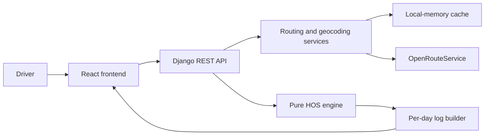

# ELD Trip Planner

A trip-planning assessment for property-carrying drivers: route a trip, schedule
duty changes, and generate a Driver's Daily Log for each calendar day.

**Current stage: Phase 5 — trip summary and synchronized itinerary.** The React
app submits validated trip details to the stateless Django API and displays the
route, required stops, summary, and chronological itinerary. The API returns
complete daily logs; drawn SVG log sheets and exports follow in Phase 6.

## Stack and architecture

- Backend: Python 3.12, Django 5, Django REST Framework, and pytest.
- Frontend: React 18, Vite, TypeScript, Tailwind CSS, and Leaflet.
- Routing: server-side OpenRouteService, with provider caching and documented
  fallback behavior.
- Deployment: frontend on Vercel; backend on Render or Railway.



The frontend never receives the routing API key. The HOS engine has no network,
framework, or database dependencies. Django has no database, session, or user
authentication apps; no migrations are needed.

## Repository layout

```text
backend/
  config/               Django settings, URLs, and WSGI entry point
  trips/                Thin views, request/response serializers, safe errors
  trips/services/       Providers, planner, offline timezones, pure HOS/log builders
  trips/tests/          Provider/API tests and independent schedule/log reconstruction
  examples/             Sample trip request for local smoke testing
  requirements.txt      Pinned runtime dependencies
  requirements-dev.txt  Runtime dependencies plus pytest and Hypothesis
frontend/src/components/ Trip form, route map, summary, itinerary, and local UI primitives
frontend/src/lib/        API contracts, client, form mapping, and fixed-offset calendar views
frontend/src/hooks/      Debounced queries and persisted theme preference
frontend/src/test/       Test setup and a response fixture from the Django endpoint
.github/workflows/      CI for file hygiene and application quality
.pre-commit-config.yaml Staged secret scanning, linters, and format checks
requirements-dev.txt    Pinned Python repository tools
package.json            Pinned Node repository tools
```

## Repository tooling setup

Install Python 3.12 and Node.js 22.13 or newer (the latest Node 22 LTS is
recommended). Run these commands from the repository root.

### Windows PowerShell

```powershell
# Create a local virtual environment if one does not already exist.
py -3.12 -m venv .venv

# Install the Python tools without changing global Python packages.
.\.venv\Scripts\python.exe -m pip install -r requirements-dev.txt

# Install the locked Node tools.
npm.cmd ci

# Install the commit hook; this changes .git and is run by the repository owner.
.\.venv\Scripts\python.exe -m pre_commit install
```

If `py` is unavailable, use the full path to your Python 3.12 executable for the
first command. An existing `.venv` does not need to be recreated.

### Bash / zsh on macOS or Linux

```bash
# Create the Python environment.
python3.12 -m venv .venv

# Install the Python tools.
.venv/bin/python -m pip install -r requirements-dev.txt

# Install the Node tools.
npm ci

# Install the commit hook; the repository owner runs this command.
.venv/bin/python -m pre_commit install
```

### Checks

```powershell
# Check supported text files with Prettier.
npm.cmd run format:check

# Validate the hook configuration without running Git.
.\.venv\Scripts\python.exe -m pre_commit validate-config

# After files are staged, run every commit hook, including staged secret scanning.
.\.venv\Scripts\python.exe -m pre_commit run --all-files
```

On macOS/Linux, replace `npm.cmd` with `npm` and
`.\.venv\Scripts\python.exe` with `.venv/bin/python`.

The GitHub workflow runs on every push and pull request. Repository hygiene runs
immediately. Backend lint, formatting, and tests activate when
`backend/requirements-dev.txt` is introduced. Frontend lint, typecheck, Vitest,
and build activate when `frontend/package.json` is introduced. Python and
frontend source hooks skip when there are no matching source files in Phase 0.
CI scans repository history for secrets; the commit hook scans staged changes.
The backend job is active from Phase 1. Frontend checks remain inactive until the
frontend is introduced. Both application jobs are now active.

## Run the frontend

Keep Django running at `http://127.0.0.1:8000` using the backend instructions
below. In a **second PowerShell window**, change to the repository root and run:

```powershell
# Open the project directory.
Set-Location -LiteralPath 'C:\Users\walde\OneDrive\Documents\assesment_truck'

# Install the frontend's locked dependencies.
npm.cmd ci --prefix frontend

# Start Vite; keep this terminal open.
npm.cmd --prefix frontend run dev
```

On macOS/Linux, change to your clone's root with `cd /path/to/truckmena` and
replace `npm.cmd` with `npm`. Open `http://localhost:5173`, click **Use sample
trip**, then **Plan trip**. Vite forwards `/api` to Django; no frontend environment
file or CORS change is required for this local setup. The strict port setting
prevents Vite silently moving to an origin that the backend does not allow.
Stop either development server with **Ctrl+C** in its terminal.

After planning, **Summary** shows provider mileage, scheduled driving/trip time,
daily-log count, and stop counts from the API. The colored trip bar covers only
the scheduled events, excluding OFF padding added to make daily log sheets total
24 hours. **Delivery complete** includes the final hour of unloading; the delivery
marker shows arrival at the start of unloading.

The cycle gauge uses the final log's exact `cycle_used_min` and the API summary's
remaining cycle time. It reflects any completed restart. Allowed non-driving
work may finish above 70 hours: the gauge fills at 70 while its text shows actual
use and zero availability. It does not infer historical rolling-hour dropoff.

**Itinerary** groups every event by calendar day in the API's fixed trip offset,
including a portion on each day of an overnight event. An exact midnight finish
does not add an empty day. Continued rows show their portion's duration and retain
the original event ID: selecting one opens the **full event** at its original API
start coordinate and time. This is explicit on those rows; no new driving position
is invented for a midnight continuation.

Selecting an itinerary event brings its map popup into view. Map selection opens
the itinerary tab and scrolls only its internal list to the corresponding event.
Hovering or focusing a row highlights the map marker; map hover highlights the
row. Driving events get a temporary start marker while selected or hovered.
Map markers support Enter and Space for the same selection as a pointer click.
Tabs support Left/Right arrows, Home, End, and Tab. A successful new plan clears
selection and returns to Summary; edited or updating results are labeled stale.

Phase 5 visual verification: plan the sample trip, check both tabs, select a rest
that continues after midnight, then select Pickup on the map. Repeat at a mobile
viewport and in dark mode. Local review screenshots are saved in the ignored
`.tools/phase5-preview` directory; attach these to the phase PR if desired.

For a separately hosted API, put its origin (for example
`https://your-backend.example`) after `VITE_API_BASE_URL=` in the ignored
`frontend/.env`. Restart Vite after changing that value. This is public build
configuration: **never put an ORS key in a `VITE_` variable**. Production builds
require the deployed API origin and matching backend CORS configuration.

Frontend checks, from the repository root:

```powershell
# Check source lint and TypeScript.
npm.cmd --prefix frontend run lint
npm.cmd --prefix frontend run typecheck

# Run network-isolated interaction and API contract tests.
npm.cmd --prefix frontend run test -- --run

# Produce the production build in the ignored frontend/dist directory.
npm.cmd --prefix frontend run build

# Check frontend dependency advisories.
npm.cmd audit --prefix frontend
```

The address combobox waits 350ms and requires three characters, caches results
for five minutes, and supports arrows, Home/End, Enter, Escape, and Tab. Editing a
selected address removes its old coordinates. Complete addresses may still be
submitted if autocomplete fails. The sample includes coordinates and lets the
API infer departure from Chicago's current local offset.

An optional departure date/time uses the browser's timezone offset at that date;
leaving it blank lets the API infer the start location's offset. The map popups
always display the returned trip offset rather than converting to the viewer's
zone. Request cancellation, timeouts, field validation, and fallback warnings
are explicit. HOS calculation remains server-side.

The map lazy-loads Leaflet and fits the entire route. Every required stop has a
keyboard-focusable marker and a popup; the expandable stop list provides another
way to open those popups. Editing a displayed trip marks the map as stale until
planning succeeds again. Dark mode persists locally; light mode is the default.
Fonts are self-hosted. Only visible OpenStreetMap tiles are requested, with
visible attribution and normal browser caching; see the
[OSM tile policy](https://operations.osmfoundation.org/policies/tiles/).

The local Button and Input primitives adapt the React 18
[shadcn/ui](https://ui.shadcn.com/) pattern using Radix Slot, variant utilities,
and shared theme tokens. Their MIT notice is in `frontend/THIRD_PARTY_NOTICES.md`.
`components.json` and the `@` alias support adding further UI components.

Frontend tests cover cycle boundaries, sample and request mapping, midnight-safe
offset display, nested API errors, cancellation/timeouts, response validation,
debouncing, keyboard selection, stale-coordinate removal, and form submission.
Summary/itinerary tests cover cycle use above 70 after permitted work, restart
recaps, OFF-padding exclusion, midnight/year/leap-day boundaries, fixed offsets,
tab keyboard navigation, and selection/hover/popup reset across both views.
The JSON contract fixture was generated through the real Django endpoint using
mocked provider responses. Automated tests never call external providers.

## HOS engine setup and verification

From the repository root in Windows PowerShell:

```powershell
# Install the backend's pinned test tools.
./.venv/Scripts/python.exe -m pip install -r backend/requirements-dev.txt

# Run boundary examples and independent replay of generated schedules.
./.venv/Scripts/python.exe -m pytest -q

# Check Python lint and formatting.
./.venv/Scripts/python.exe -m ruff check backend
./.venv/Scripts/python.exe -m black --check backend
```

On macOS/Linux, replace `./.venv/Scripts/python.exe` with
`.venv/bin/python`. Pytest also works from `backend/`, matching CI.

`backend/trips/services/hos_engine.py` exports:

- `schedule_trip(legs, cycle_used_hours, config=...)`: deterministic scheduling
  of exactly two connected legs, with one pickup and one delivery.
- `advance_clock(state, status, duration_min)`: a pure duty-clock transition
  that rejects an illegal driving interval and returns a new immutable state.
- `available_driving_minutes(state)`: the tightest remaining HOS allowance.

Domain events carry integer minutes since departure, exact fractional mileage,
duty status, event type, stable IDs, and cycle usage before/after the interval.
The mile marker and place refer to the interval's start/status-change position;
driving intervals also expose both mileage endpoints.
The API service adds timestamps, coordinates, and optional reverse-geocoded
remarks; the engine makes no I/O calls.

The tests cover short and multi-day trips, the 8/11/14-hour boundaries, 30-minute
breaks, 10-hour rests, 34-hour restarts, 1,000-mile fuel frontiers, zero-mile legs,
cycle overflow during work, simultaneous constraints, and fractional inputs.
Two Hypothesis tests generate 450 schedules per run, plus explicit regression
examples. A separate event replayer checks every driving interval against the
clocks without using the engine's transition functions.

## Run the backend API

From the repository root in **Windows PowerShell**, use the existing `.venv`:

```powershell
# Install runtime and test dependencies.
./.venv/Scripts/python.exe -m pip install -r backend/requirements-dev.txt

# Create the ignored configuration file only if it does not already exist.
if (-not (Test-Path -LiteralPath 'backend/.env')) {
    Copy-Item -LiteralPath 'backend/.env.example' -Destination 'backend/.env'
}

# Open this file locally; never paste its contents into a chat or commit it.
notepad.exe backend/.env
```

In that file, put your ORS key after `ORS_API_KEY=` and set `DJANGO_DEBUG=true`.
Leave the other values blank for local defaults: host `127.0.0.1`, frontend
origin `http://localhost:5173`, Nominatim disabled. Local development uses a
random, temporary Django secret when none is configured. Restart the server
after editing environment values.

```powershell
# Check Django configuration without contacting any provider.
./.venv/Scripts/python.exe backend/manage.py check

# Start the development API; keep this terminal open.
./.venv/Scripts/python.exe backend/manage.py runserver 127.0.0.1:8000
```

Open a **second PowerShell window**, change to the repository root, and run:

```powershell
# Check the server without spending provider quota.
Invoke-RestMethod -Uri 'http://127.0.0.1:8000/api/health'

# Plan the supplied Chicago -> Dallas -> Los Angeles example.
$sampleTrip = Get-Content -LiteralPath 'backend/examples/sample-trip.json' -Raw
$tripPlan = Invoke-RestMethod -Method Post -Uri 'http://127.0.0.1:8000/api/trips/plan' -ContentType 'application/json' -Body $sampleTrip

# Inspect the provider, summary, and fallback warnings.
$tripPlan.route.provider
$tripPlan.summary
$tripPlan.warnings
```

The sample coordinates bypass forward geocoding. A configured, working ORS key
should produce provider `ors`; an outage or missing key produces `osrm` with a
visible truck-restriction warning. Press **Ctrl+C** in the server window to stop.
`gunicorn` is for Linux deployment; use `runserver` on Windows.

On **macOS/Linux**, use `.venv/bin/python` and these configuration/request commands:

```bash
# Create the local environment file without overwriting existing values.
test -f backend/.env || cp backend/.env.example backend/.env

# Edit the file with your preferred editor and supply ORS_API_KEY locally.
nano backend/.env

# Check and start the API.
.venv/bin/python backend/manage.py check
.venv/bin/python backend/manage.py runserver 127.0.0.1:8000
```

In a second terminal at the repository root:

```bash
# Check health and request the sample trip.
curl --fail-with-body http://127.0.0.1:8000/api/health
curl --fail-with-body -H 'Content-Type: application/json' --data-binary @backend/examples/sample-trip.json http://127.0.0.1:8000/api/trips/plan
```

## API contract and errors

| Method | Path                        | Behavior                                        |
| ------ | --------------------------- | ----------------------------------------------- |
| GET    | `/api/health`               | Local health check; no provider or database I/O |
| GET    | `/api/geocode/autocomplete` | `q` of at least 3 characters; up to 5 results   |
| POST   | `/api/trips/plan`           | Validated locations and cycle -> scheduled trip |

Paths have no trailing slash. Plan inputs follow
[`backend/examples/sample-trip.json`](backend/examples/sample-trip.json).
Each location needs a nonblank `label`; supply both `lat` and `lng` to use a
selected suggestion, or omit both for submitted address lookup. Coordinates
must be finite and in range. Cycle hours must be a finite number from 0 through 70. Pickup and dropoff within one meter are treated as the same location and
rejected; current and pickup may coincide. Unknown input fields are rejected.

If supplied, `start_time` requires an explicit ISO timezone offset or `Z`;
offsets must use whole minutes. The API preserves that fixed offset for the
entire trip. If omitted, it uses the current minute in the current location's
timezone, inferred offline with `tzfpy` and `zoneinfo`. The inferred offset is
also frozen at departure, so crossing a timezone or daylight-saving date does
not change the planning grid. Supply an explicit offset to override coordinate
inference, including near timezone boundaries. Seconds and microseconds are
truncated to the minute. Optional driver, carrier, vehicle, and freight fields
have complete demo defaults. `carrier.home_terminal_address` is optional and
defaults to the supplied main office address.

The response contains `route`, `summary`, `events`, and `logs`. Geometry is
`[[lat,lng],...]`; legs retain `from`, `to`, and authoritative provider `miles`.
Additional route fields expose `provider`, `profile`, `provider_duration_hours`
(reference only), and `attribution`. Every duty event has the specified ID,
type, status, ISO start/end, integer duration, coordinates, place, mile marker,
and note. `mile_marker` is the interval's start position; `end_mile_marker`
records its end position. The separate `event-start` marker has zero duration
and is excluded from duty accounting. All positive intervals are contiguous.

`logs` contains completed daily sheets and `log_generation_available` is true.
`summary.log_days` equals the number of sheets. Ending exactly at midnight adds
no empty day; the final interval belongs to the date it just finished.

Validation, missing addresses, identical pickup/dropoff, and unrouteable points
produce clear **400** responses. Invalid JSON produces **400**; unsupported
methods/content types produce **405/415**. Local throttling produces **429**
(60 autocomplete requests/minute and 10 plans/minute per client). Provider
failure after applicable fallback produces **502**. Public service errors have
`detail` and `code`; field validation returns messages keyed by field. Unexpected
errors return a generic **500**; logs record the exception class without its
message or traceback. No provider response or credential is echoed to users.

## Daily logs and recap assumptions

`build_daily_logs(schedule, start, metadata=..., places=...)` is a pure function
in `backend/trips/services/log_builder.py`. It returns immutable daily sheets
without network, filesystem, Django, or database I/O. The planner passes in
already enriched event labels; midnight driving continuations use their
computed `Mile N on route` position when no city label is available.

- Every positive engine interval is split at fixed-offset midnight. Every sheet
  covers minute 0 through 1440, with no zero-length segments, gaps, or overlaps.
  Only time before departure and after final delivery is filled as OFF. Padding
  is explicitly marked and never contributes mileage or resets cycle state.
- Mileage is allocated in proportion to minutes within each driving interval,
  using exact fractions. All daily miles sum exactly to the provider mileage
  internally; JSON exposes numeric values without rounding daily mileage.
- `totals_min` gives exact integer minutes for `off`, `sleeper`, `driving`, and
  `on_duty`. `totals` gives display hours to two decimal places. Largest-remainder
  rounding distributes hundredths so the four displayed rows always sum to
  **24.00**, rather than independently rounding to 23.99 or 24.01. Use minutes
  for calculations and display hours for printing.
- Every sheet includes `date` (`MM/DD/YYYY`), sortable `iso_date`, daily
  `from`/`to`, `total_miles`, `total_mileage_today`, `cumulative_trip_miles`,
  `segments`, `remarks`, `recap`, driver/carrier/office/terminal/vehicle/freight
  headers, `timezone_offset`, and midnight `period_start`. Total mileage today
  equals routed driving mileage; no odometer or other vehicle mileage is invented.
- Segments include minute-of-day bounds, duty status, place, source `event_id`,
  mile-marker bounds, and `is_padding`. Remarks retain work/stop notes, annotate
  midnight continuations, and mark the completed restart. A remark at minute
  1440 belongs to the ending sheet when a restart finishes exactly at midnight.

The assessment supplies only one cycle-usage number, not prior daily records.
The recap is therefore a **planning estimate** under the same no-hours-drop-off
assumption as the scheduler:

| Field | Calculation                                                        |
| ----- | ------------------------------------------------------------------ |
| A     | Initial cycle minutes + scheduled on-duty minutes since last reset |
| B     | `max(0, 70 hours - A)`; no unknown rolling hours become available  |
| C     | On-duty time in the last five trip calendar dates, including today |

A 34-hour restart resets A only at its scheduled completion, including the
exact midnight boundary. An unfinished restart keeps the old cycle value.
Recaps distinguish `restart_in_progress` from `restart_taken` and show
"34-hour restart taken" on the completion date. Final work can take A above 70;
B remains zero while driving is prohibited. C excludes pre-trip history and
retains observed duty time before restarts inside its five-date window. The
five-day C field follows this assessment's requested definition; it is not a
reconstruction of an actual carrier's historical rolling recap.

Recap A/B/C and `on_duty_today` are display hours; companion integer-minute
fields preserve cycle and five-day calculations. Recap notes explain missing
history. First/last-day OFF padding is a display assumption, not evidence about
the driver's actual work outside this trip.

Real records use the home terminal's time standard and total 24 hours under
[49 CFR 395.8(f)(8) and (11)](https://www.ecfr.gov/current/title-49/subtitle-B/chapter-III/subchapter-B/part-395/subpart-A/section-395.8).
This assessment uses the supplied departure offset or start-location offset as
its terminal-time proxy, freezing it across DST to meet the requested 24-hour
grid. Terminal addresses are header text, not a separate timezone input. These
generated sheets describe a planned trip rather than certified historical duty
records.

Tests reconstruct the original schedule from log fragments and independently
derive end-of-day cycles from duty intersections. Generated trips vary mileage,
cycle usage, departure minute, and offsets including half-hour/quarter-hour
zones. Examples cover each stop type crossing midnight, full off-duty days,
fractional mileage, year rollover, exhausted cycles, completed/pending restarts,
display rounding, and midnight endings. API tests verify the rendered contract
and preservation of custom header fields. SVG and exports follow in Phase 6.

## Providers, caching, and usage policies

ORS receives **one** `driving-hgv` directions request with all three waypoints,
using GeoJSON with instructions enabled, because ORS otherwise removes the
per-leg distance segments. Turn steps are discarded during parsing and are
not cached or returned to the frontend. Server-only authorization headers keep
the key out of query strings. Provider distances feed exact fractional engine
miles; travel duration is never used for HOS scheduling. A per-leg haversine
index scales map positions to each leg's provider distance so pickup stays at
the correct waypoint even when geometry length differs from reported mileage.

Django's local-memory cache stores successful routes and geocodes for 24 hours,
with a bounded entry count. Cache keys hash normalized queries and coordinates.
ORS transport, quota, and authentication failures cause a 30-second cooldown.
OSRM fallback routes are cached for 60 seconds so ORS can be retried soon.
Missing reverse results are cached for 60 seconds; repeated places share one
lookup. Reverse enrichment has an eight-lookup/three-second start budget per
trip, uses at most four request starts/second, and skips contention. One in-flight
lookup can exceed the budget until its timeout. Failed or unattempted remarks
use `Mile N on route`. Known current/pickup/dropoff labels need no reverse call.

OSRM uses its **car** profile and cannot verify truck height, weight, or road
restrictions. Every fallback plan includes a warning in `warnings`, plus
`route.provider = "osrm"`. An ORS no-route result is a client error and is not
silently replaced with a car route. Public OSRM requests are paced at least
1.1 seconds apart in one process. HTTP requests have bounded connect/read
timeouts, no redirects/retries, and an 8 MiB response ceiling. Corrupt legs over
100,000 km or one year of provider travel time are rejected before scheduling.

**Public Nominatim is disabled by default.** Its
[usage policy](https://operations.osmfoundation.org/policies/nominatim/) forbids
autocomplete, requires an identifying User-Agent and attribution, limits the
whole application to at most one request/second, and discourages bulk use.
This app never sends autocomplete or batches reverse lookups to Nominatim.
The optional fallback only searches full addresses submitted with **Plan Trip**,
when ORS lookup fails. Do not submit confidential addresses to public providers.

To deliberately enable this fallback for a small assessment/demo deployment:

1. Read the policy linked above and set `NOMINATIM_ENABLED=true` in `backend/.env`.
2. Set `GEOCODING_USER_AGENT` to identify this application and provide your
   project/contact URL, for example `truckmena/0.1 (https://example.com/contact)`;
   replace that example URL with your own contact URL.
3. Run **one worker on one replica**, because pacing and caching are per process.
   Requests share a serialized 1.1-second gate. Multiple workers or deployments
   need a shared limiter/cache or a self-hosted/commercial service instead.
4. Display `route.attribution` in the map/results. Provider URLs can be changed
   with `ORS_BASE_URL`, `OSRM_BASE_URL`, and `NOMINATIM_BASE_URL` without code edits.

Keep Nominatim disabled if these conditions cannot be met. Deployment scaling
and provider quotas also need shared coordination beyond the assessment's
local-memory cache. Frontend autocomplete now debounces searches by 350 ms.

The automated suite makes **no external requests** and needs **no API key**.
It exercises real provider parsing, cached/fallback paths, policy gates, safe
errors, coordinate placement, and API-to-HOS integration. A separate live
sample-trip smoke check verified OSRM; ORS's live credential check is performed
locally with the ignored environment file.

Provider references:
[ORS request/response types](https://giscience.github.io/openrouteservice/api-reference/endpoints/directions/requests-and-return-types),
[ORS geocoder](https://giscience.github.io/openrouteservice/api-reference/endpoints/geocoder/),
[ORS segment/instruction behavior](https://github.com/GIScience/openrouteservice/blob/main/ors-engine/src/main/java/org/heigit/ors/routing/RouteResultBuilder.java#L132),
[OSRM API](https://project-osrm.org/docs/v5.24.0/api/),
[OSRM demo server](https://github.com/Project-OSRM/osrm-backend/wiki/Demo-server).

## Environment and secrets

- Backend configuration belongs in `backend/.env`, copied from
  `backend/.env.example`. All example values are empty.
- `ORS_API_KEY` belongs only in the backend environment or the backend host's
  secret settings. Never put it in frontend configuration or Git commands.
- Frontend configuration belongs in `frontend/.env`, copied from
  `frontend/.env.example`. `VITE_API_BASE_URL` is public configuration.
- `.gitignore` excludes real environment files, virtual environments,
  dependencies, caches, logs, and build output.
- Before the first commit, the repository owner verifies
  `git check-ignore -v backend/.env` and reviews the staged paths.
- If a secret is committed, rotate it; deleting it from the current files does
  not remove exposure from history.

## Assumptions and HOS rules

The implementation follows the property-carrying rules in the
[FMCSA HOS summary](https://www.fmcsa.dot.gov/regulations/hours-service/summary-hours-service-regulations).

| Constraint                | Implementation                                                                                                                       |
| ------------------------- | ------------------------------------------------------------------------------------------------------------------------------------ |
| 11-hour driving allowance | At most 660 driving minutes between qualifying daily rests                                                                           |
| 14-hour duty window       | Driving ends by 840 elapsed minutes after the first on-duty activity; short off-duty pauses do not extend it                         |
| Driving break             | Before exceeding 480 accumulated driving minutes, require 30 consecutive non-driving minutes; mixed non-driving statuses can qualify |
| 70-hour cycle             | Driving and on-duty work consume cycle hours; prohibit further driving at 4,200 minutes                                              |
| Daily rest                | 600 continuous minutes in OFF/SLEEPER restore daily driving and window allowances                                                    |
| Restart                   | 2,040 continuous minutes in OFF/SLEEPER restore cycle and daily allowances                                                           |
| Fuel                      | A 30-minute ON_DUTY stop before driving beyond a 1,000-mile gap                                                                      |

Additional assessment assumptions:

- A property-carrying solo driver using the 70-hour / 8-day cycle.
- No cycle hours drop off during the trip because the input does not include
  the driver's historical daily hours.
- A fresh daily driving allowance and duty window at trip start; the supplied
  cycle usage is the only prior-duty input.
- Driving is on-duty activity and starts the duty window if it is the first
  activity. Midnight by itself resets no HOS clock.
- Provider distance determines mileage; driving time uses a configurable
  planning speed of 55 mph.
- Pickup and dropoff each take one hour on duty; fueling takes 30 minutes on
  duty at intervals of no more than 1,000 miles.
- Use a consistent start-time offset for log-day boundaries.

### Boundary and rounding decisions

- Arrival work happens before a pause needed for the next drive. Pickup,
  delivery, and fueling can finish even when non-driving work takes cycle usage
  above 70 hours. No driving follows until the cycle is reset. Available cycle
  hours are clamped at zero while exhausted.
- At exactly eight driving hours, a one-hour pickup satisfies the break.
  A final arrival does not add a gratuitous break, rest, restart, or fuel stop.
  A fuel gap of exactly 1,000 miles is allowed at the final destination; fuel is
  inserted at that mile marker before any additional driving.
- If limits coincide, resolve cycle restart, daily rest, fuel, then driving
  break. A fuel stop satisfies the driving break. Fuel and a sleeper rest retain
  their distinct duty statuses at the same route position.
- All clocks use integer minutes. Initial cycle usage is rounded up to the next
  minute. Distances use exact rational arithmetic derived from the supplied
  decimal mileage; fuel frontiers remain exactly 1,000 miles.
- Driving duration uses `miles / average_mph * 60`, rounded up at each fuel
  frontier or leg end. This can add less than one minute at each such frontier
  while preserving provider mileage and never understating driving time.
- The public API keeps pickup and delivery at 60 minutes. Domain-level
  fixtures use longer pickup durations to exercise the 14-hour limit directly.
- The pure engine accepts an already exhausted cycle, including values above
  70, and restarts first. The API enforces its specified 0–70 input
  range.

Split-sleeper pairing, adverse-driving extensions, short-haul exceptions, and
team drivers are outside the assessment scope. Log-day and recap assumptions
are documented above and enforced by the daily-log tests.

## Delivery phases

| Phase | Work                                            |
| ----- | ----------------------------------------------- |
| 0     | Repository foundation, hooks, and CI            |
| 1     | Pure HOS engine and boundary/invariant tests    |
| 2     | Routing, geocoding, and stateless REST API      |
| 3     | Calendar-day log builder and 24-hour invariants |
| 4     | Frontend shell, form, autocomplete, and map     |
| 5     | Itinerary and trip summary                      |
| 6     | Daily Log SVG rendering and PNG/PDF exports     |
| 7     | Accessibility, responsive layout, and polish    |
| 8     | Deployment configuration and final verification |

The repository owner executes all Git commands. Every phase starts after a
verified before-checkpoint and ends with reviewed paths, passing checks,
Conventional Commits, and a verified push. After the initial setup commit,
changes use short-lived phase branches and pull requests into `main`.

## Submission documentation to complete

- Application setup and sample-trip walkthrough.
- API contract and provider failure behavior.
- Screenshots: desktop planner, mobile planner, and daily log.
- Vercel and Render/Railway deployment steps and free-tier wake-up behavior.
- A 3–5 minute Loom talk track: sample trip, HOS engine, log rendering, code
  structure, Git workflow, and trade-offs.

## Tooling references

- [pre-commit setup and hook configuration](https://pre-commit.com/)
- [File hygiene hooks](https://github.com/pre-commit/pre-commit-hooks)
- [Gitleaks staged secret scanning](https://github.com/gitleaks/gitleaks/tree/v8.24.2)

## License

[MIT](LICENSE).
