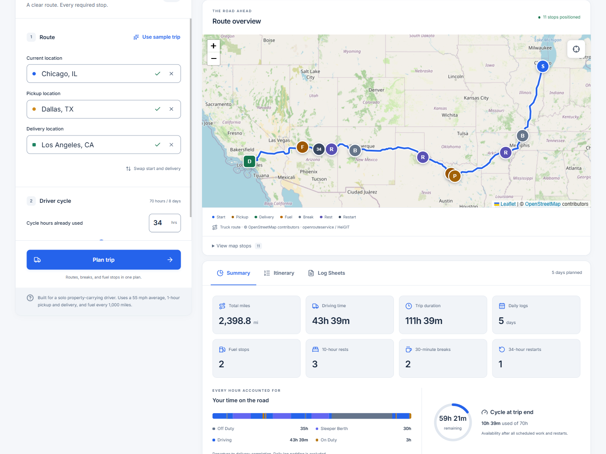
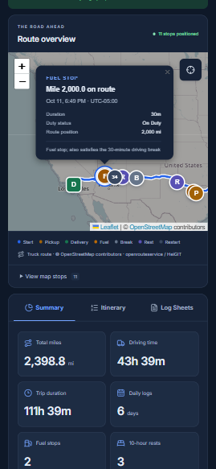
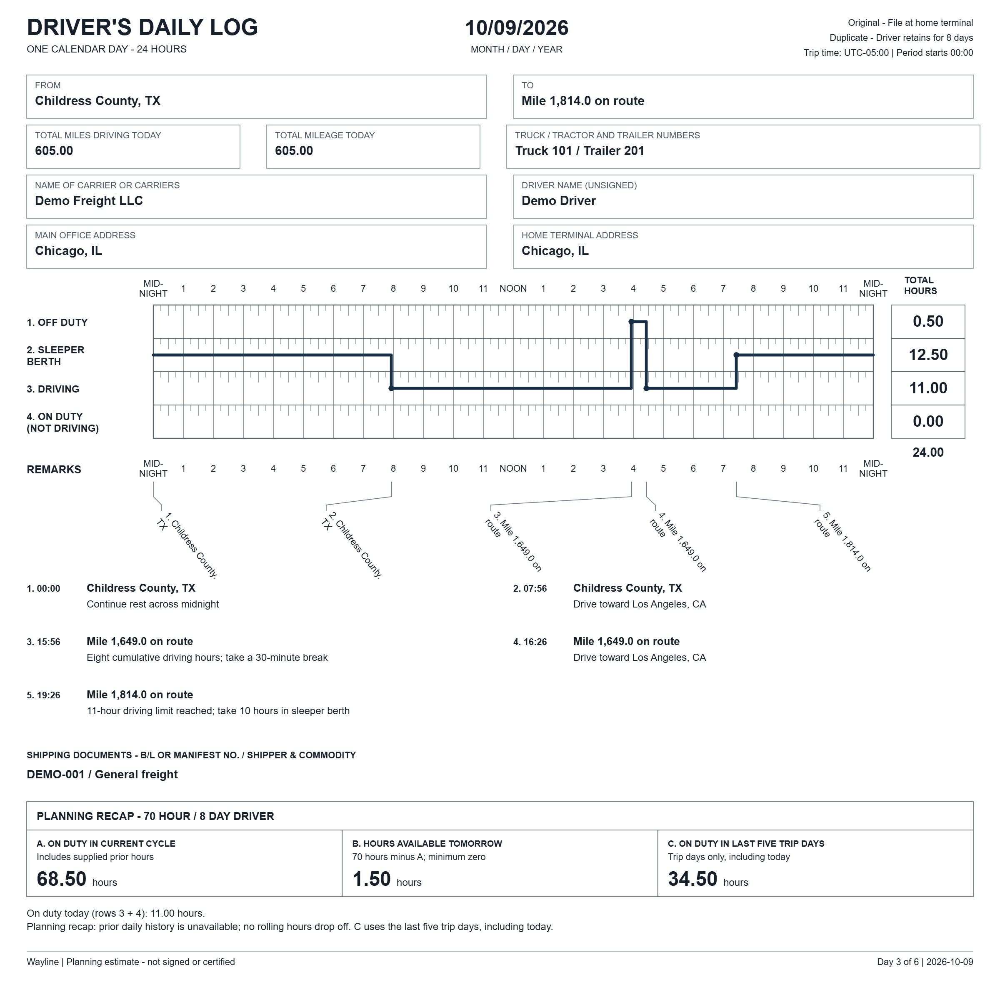
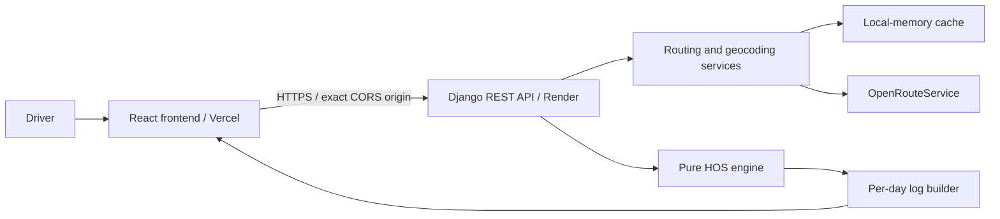

# Wayline

A truck trip planner that turns a route and current cycle usage into required stops, an itinerary, and daily driver log sheets.

[](https://github.com/Demeriwael/truckmena/actions/workflows/ci.yml)
[](LICENSE)


## Live demo

- [Open Wayline](https://wayline.demeri.dev/)
- [API health](https://truckmena-api.onrender.com/api/health)

Render's free backend sleeps when idle; the first plan can take about a minute to start. Keep the page open while it wakes. See [Render's free-service limits](https://render.com/docs/free).

1. Select **Use sample trip** to load Chicago → Dallas → Los Angeles.
2. Select **Plan trip**, then explore **Summary**, **Itinerary**, and **Log Sheets**.

## Screenshots

### Desktop planner



### Mobile dark theme



### Daily log sheet



## Walkthrough

**Loom walkthrough:** recording pending.

<!-- Loom link slot: replace the line above with the public recording link. -->

Use the [four-minute recording outline](docs/SUBMISSION.md#4-minute-loom-talk-track).

## Features

- Three-waypoint route map with provider mileage and positioned stops.
- Minute-based HOS scheduling with driving breaks, daily rests, cycle restarts, and fuel stops.
- Trip summary and itinerary synchronized with map selection.
- Daily SVG log sheets with exact-minute totals and full 24-hour coverage.
- Single-day PNG/PDF exports and one PDF for the whole trip.
- Responsive light/dark themes, keyboard controls, and readable text log details.
- Validated inputs, request throttling, server-only provider credentials, and visible fallback warnings.

## Architecture

Python 3.12, Django 5, and Django REST Framework serve the API. React 18, Vite, TypeScript, Tailwind CSS, and Leaflet provide the frontend.



The API is stateless: no database, accounts, sessions, or migrations. The HOS engine and log builder perform no network or framework I/O. Provider credentials stay on the backend; exports run in the browser.

Details: [providers and caching](docs/PROVIDERS.md), [log sheets and exports](docs/LOG_SHEETS.md), and [accessibility](docs/ACCESSIBILITY.md).

## Quick start

Install **Python 3.12** and **Node 22.13–22.x**. Python must be available as `python3.12`, `python3`, `python`, or Windows `py -3.12`.

Clone or [download the source ZIP](https://github.com/Demeriwael/truckmena/archive/refs/heads/main.zip). Open a terminal in the repository root, which contains `package.json`.

### Bash — macOS / Linux

```bash
npm run setup
npm run dev
```

### Windows PowerShell

```powershell
npm.cmd run setup
npm.cmd run dev
```

Open **http://localhost:5173**, select **Use sample trip**, then **Plan trip**. Django runs at `http://127.0.0.1:8000`; Vite proxies local `/api` requests. **Ctrl+C** stops both servers. On Windows, answer `Y` if a “Terminate batch job” prompt appears.

Setup installs pinned Python dependencies and locked npm dependencies, creates a Python environment if absent, and copies missing environment examples. Existing environments and configuration are preserved; incompatible Python versions are rejected. Stop development servers before rerunning setup.

The coordinate-based sample needs no API key: it can use OSRM's car routing with a warning that truck restrictions are not checked. For ORS truck routing and address search, configure `ORS_API_KEY` in `backend/.env`, then restart. Public Nominatim fallback is disabled by default.

See [development commands](scripts/README.md) for builds and local previews, and [deployment instructions](docs/DEPLOYMENT.md) for hosting.

## Environment variables

Backend values live in `backend/.env` or Render's environment settings. Frontend values live in `frontend/.env` or Vercel's environment settings. Setup copies the empty [backend](backend/.env.example) and [frontend](frontend/.env.example) examples without overwriting existing files.

| Variable                   | Where    | Requirement                                                                           | Public / secret |
| -------------------------- | -------- | ------------------------------------------------------------------------------------- | --------------- |
| `ORS_API_KEY`              | Backend  | Optional for the coordinate sample; required for ORS routing and geocoding            | Secret          |
| `DJANGO_SECRET_KEY`        | Backend  | Required in production; at least 50 characters for deployment checks                  | Secret          |
| `DJANGO_DEBUG`             | Backend  | Optional locally; `false` in production                                               | Public          |
| `DJANGO_SETTINGS_MODULE`   | Backend  | `config.production_settings` for deployment                                           | Public          |
| `DJANGO_ALLOWED_HOSTS`     | Backend  | Explicit production hosts; Render supplies its service hostname automatically         | Public          |
| `RENDER_EXTERNAL_HOSTNAME` | Render   | Set automatically by Render                                                           | Public          |
| `CORS_ALLOWED_ORIGINS`     | Backend  | Exact frontend origins for separate hosting; local default is `http://localhost:5173` | Public          |
| `DJANGO_TRUST_PROXY`       | Backend  | `true` behind Render's trusted HTTPS ingress; otherwise optional                      | Public          |
| `NOMINATIM_ENABLED`        | Backend  | Optional; defaults to `false`                                                         | Public          |
| `GEOCODING_USER_AGENT`     | Backend  | Required only if Nominatim is enabled; must identify the application                  | Public          |
| `ORS_BASE_URL`             | Backend  | Optional provider override                                                            | Public          |
| `OSRM_BASE_URL`            | Backend  | Optional provider override                                                            | Public          |
| `NOMINATIM_BASE_URL`       | Backend  | Optional provider override                                                            | Public          |
| `VITE_API_BASE_URL`        | Frontend | Blank for local development; required API origin for builds                           | Public          |

“Public” means non-secret; only `VITE_API_BASE_URL` is frontend build configuration. Never put credentials in a `VITE_` variable. Real environment files are ignored.

For this demo, the frontend API origin is `https://truckmena-api.onrender.com`, without `/api` or a trailing slash. The backend must allow `https://wayline.demeri.dev` in `CORS_ALLOWED_ORIGINS`. See [deployment configuration](docs/DEPLOYMENT.md).

## API reference

Canonical paths have **no trailing slash**.

| Method | Endpoint                              | Result                                                             |
| ------ | ------------------------------------- | ------------------------------------------------------------------ |
| GET    | `/api/health`                         | Service status; no provider or database calls                      |
| GET    | `/api/geocode/autocomplete?q=Chicago` | Up to five address suggestions; searches start at three characters |
| POST   | `/api/trips/plan`                     | Route, summary, events, daily logs, and provider warnings          |

With the local servers running, submit the [cross-country request](backend/examples/sample-trip.json):

```bash
curl --fail-with-body \
  -H 'Content-Type: application/json' \
  --data-binary @backend/examples/sample-trip.json \
  http://127.0.0.1:8000/api/trips/plan
```

PowerShell equivalent:

```powershell
$sampleTrip = Get-Content -LiteralPath backend/examples/sample-trip.json -Raw
Invoke-RestMethod -Method Post -Uri 'http://127.0.0.1:8000/api/trips/plan' -ContentType 'application/json' -Body $sampleTrip
```

Successful ORS response excerpt; geometry, summary, events, and logs are omitted:

```json
{
  "route": { "provider": "ors", "profile": "driving-hgv" },
  "warnings": [],
  "log_generation_available": true
}
```

An OSRM fallback instead reports `provider: "osrm"`, `profile: "driving"`, and a truck-restriction warning. Route geometry uses `[lat, lng]` pairs. Events include ISO start/end times, integer durations, locations, and mile markers; logs include duty segments, exact-minute totals, remarks, and recaps.

Each location needs a label and either both coordinates or neither. `cycle_used_hours` is a finite number from 0 through 70. Optional `start_time` requires an explicit ISO timezone offset or `Z`; omission infers the start location's current offset. Unknown fields and identical pickup/delivery points are rejected.

Validation returns **400**, throttling **429**, provider failures after fallback **502**, and unexpected errors a generic **500**. Field errors are keyed by field; service errors contain `detail` and `code`.

## HOS rules and assumptions

Wayline models a solo property-carrying driver using the 70-hour / 8-day cycle. The [FMCSA summary](https://www.fmcsa.dot.gov/regulations/hours-service/summary-hours-service-regulations) describes the underlying limits; the table describes this planner's implementation.

| Rule / assumption | Behavior                                                                                               |
| ----------------- | ------------------------------------------------------------------------------------------------------ |
| Driving allowance | At most 11 driving hours between qualifying daily rests                                                |
| Duty window       | No driving beyond 14 elapsed hours after the first on-duty activity; short breaks do not extend it     |
| Driving break     | Before exceeding eight accumulated driving hours, take 30 consecutive non-driving minutes              |
| Cycle limit       | Driving and work consume the 70-hour cycle; further driving is prohibited when exhausted               |
| Daily rest        | Ten continuous hours OFF/SLEEPER restore daily allowances                                              |
| Restart           | A completed 34-hour OFF/SLEEPER interval resets cycle and daily allowances                             |
| Planning speed    | Provider mileage at 55 mph; provider duration is reference only                                        |
| Work and fuel     | One hour each for pickup/delivery; 30-minute fuel stops before exceeding a 1,000-mile gap              |
| Rounding          | Integer-minute clocks; cycle input and driving durations round upward while retaining provider mileage |
| Calendar days     | Fixed departure offset, including across DST; midnight itself resets no HOS clock                      |
| Daily logs        | OFF padding completes 24-hour sheets; display totals sum to 24.00                                      |
| Planning recap    | A: used cycle; B: remaining cycle, minimum zero; C: duty time in the last five trip dates              |

Trip start assumes fresh daily allowances. Prior daily history is unavailable, so no historical cycle hours drop off. Arrival work can finish above 70 hours; driving remains prohibited until a restart. Split-sleeper pairing, team driving, adverse-driving extensions, and short-haul exceptions are outside scope.

Generated logs are unsigned planning estimates. They do not certify historical duty records. See [HOS boundaries and rounding](docs/HOS_RULES.md) and [log/recap assumptions](docs/LOG_SHEETS.md).

## Testing and CI

From the repository root after setup:

```bash
npm run check
```

PowerShell:

```powershell
npm.cmd run check
```

`npm test` (PowerShell: `npm.cmd test`) runs tooling, backend, and frontend tests once. `check` includes those tests plus Python dependency consistency, Django configuration, lint, formatting, TypeScript checks, and a frontend verification build. Its build uses `https://api.example.invalid` and makes no API requests.

Automated tests use mocked providers and need no API key. Coverage includes exact HOS boundaries, independent schedule replay, midnight splitting, full-day log invariants, provider failures, API contracts, browser interactions, accessibility, and process cleanup.

CI runs repository hygiene, backend quality/tests, and frontend lint/typecheck/tests/build on pushes and pull requests. Commit hooks scan staged changes for secrets; CI scans history. See [contributing and quality tools](docs/CONTRIBUTING.md), [accessibility checks](docs/ACCESSIBILITY.md), and the dated [deployment verification record](docs/DEPLOYMENT.md#verification-record).

## License

[MIT](LICENSE). Frontend component attribution is preserved in [third-party notices](frontend/THIRD_PARTY_NOTICES.md).
